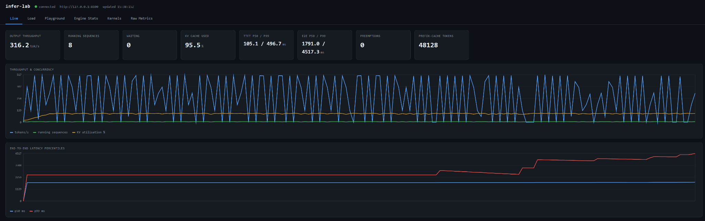
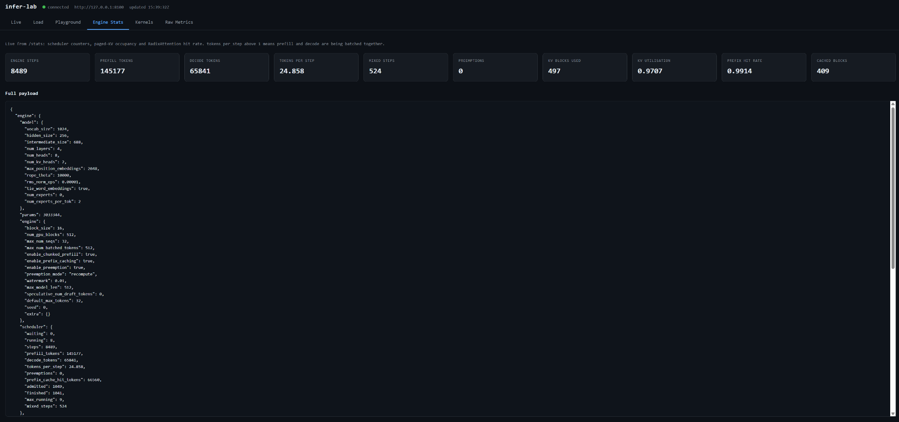
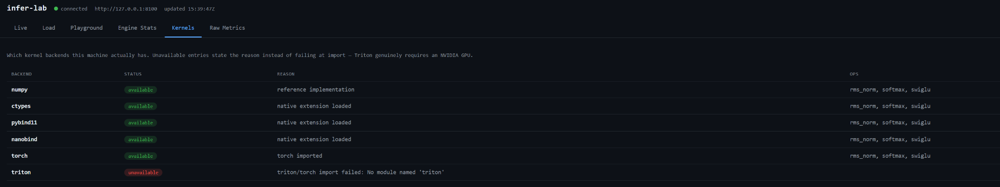
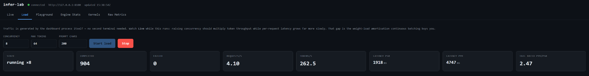
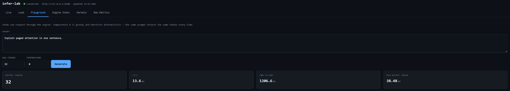

<h1 align="center">infer-lab</h1>

<p align="center">
  <strong>A from-scratch LLM inference engine, built from kernels up.</strong><br>
  PagedAttention · RadixAttention · continuous batching · speculative decoding<br>
  C++ kernels via ctypes / pybind11 / nanobind · ring all-reduce over real TCP
</p>

<p align="center">
  <a href="https://github.com/LTolo/infer-lab/actions/workflows/ci.yml">
    </a>
  
  
  
  <a href="LICENSE"></a>
</p>

---

A vertically integrated **LLM inference engine laboratory** — kernels, paged KV
memory, an iteration-level scheduler, distributed execution, profiling tools and
production observability, in one owned stack.

It reimplements the mechanisms that make modern inference engines fast
(PagedAttention, RadixAttention, continuous batching, chunked prefill,
speculative decoding, INT8 quantization) rather than wrapping a framework that
hides them.

**No Docker. No GPU required. No paid services. Two commands.**

```bash
python scripts/verify.py        # prove the whole project runs error-free
python scripts/run_stack.py     # start the app and all its dependencies
```

```
====================================================================
  27 passed   0 skipped   0 failed
```

---

## In action



Throughput, latency percentiles and KV-cache pressure while the built-in load
generator drives 8 concurrent sequences. The sawtooth is real, not noise: waves
of requests prefill together, then decode together.



**`tokens_per_step: 24.86`** is the number that matters. Decode is memory-bound —
generating one token costs a full pass over the weights regardless of how many
tokens you produce. Batching 25 tokens into one forward pass amortises that
weight read 25 times over. This single figure is the entire economic argument
for continuous batching.

**524 mixed steps** show chunked prefill interleaving long prompts with running
decodes instead of blocking them. **Prefix hit rate 0.99** alongside
**0 preemptions**: RadixAttention reuses nearly every prefix while still leaving
the scheduler enough memory that no live sequence ever has to be evicted. KV
utilisation at 97% is the target state, not a warning — the pool is fully used
without tipping over.



The same C++ kernels exposed through three binding strategies, so the
call-overhead trade-off is measured rather than argued about:

| backend | `rms_norm` p50 (512×512) | empty-call overhead |
|---|---|---|
| numpy | 0.883 ms | — |
| ctypes | 0.447 ms | 0.300 µs |
| pybind11 | 0.443 ms | 0.300 µs |
| **nanobind** | **0.436 ms** | **0.100 µs** |
| torch | 0.096 ms | — |

nanobind's roughly 3× lower call overhead is precisely why it is displacing
pybind11. The hand-written C++ kernels are ~2× faster than NumPy through fusion —
one pass per row with intermediates in registers, instead of a temporary array
per arithmetic step. Torch wins on raw GEMM because it dispatches to a
multithreaded BLAS, which is exactly where single-threaded C++ stops competing.

Triton requires an NVIDIA GPU, so it is reported unavailable with a reason
rather than failing at import.



Load is generated by the dashboard process itself — no second terminal. Raising
concurrency multiplies token throughput while per-request latency grows far more
slowly; that gap *is* the weight-load amortisation. A tail ratio (p99/p50) of
**2.47** means the scheduler is batching. Above ~5 it would be queueing instead.



One request through the engine: prefill completes in **13.6 ms**, then each
output token costs **38.5 ms**. That ratio is the whole reason decode is
memory-bound — and why batching, quantization and speculative decoding exist.

> Weights are randomly initialised and the tokenizer is byte-level, so generated
> text is meaningless by design. This is an *engine* laboratory: deterministic
> weights are what make the equivalence tests below provable. Loading real
> weights is a file-format problem, not an architecture one.

---

## What is actually implemented

### Engine internals

| Technique | Origin | Module |
|---|---|---|
| **PagedAttention** — block allocator, block tables, refcounting, copy-on-write | vLLM | `kv/block_allocator.py`, `kv/paged_cache.py` |
| **RadixAttention** — automatic prefix caching over a radix tree, LRU eviction | SGLang | `kv/radix_cache.py` |
| **Continuous batching** — iteration-level scheduling with a token budget | Orca / vLLM | `engine/scheduler.py` |
| **Chunked prefill** — long prompts sliced and interleaved with decode | vLLM | `engine/scheduler.py` |
| **Preemption** — recompute-based eviction with a forward-progress guarantee | vLLM | `engine/scheduler.py`, ADR-0004, ADR-0006 |
| **Speculative decoding** — draft proposal + single-pass target verification | — | `engine/speculative.py` |
| **INT8 per-channel quantization** | — | `quant/int8.py` |
| **Batched decode** — all running sequences in one GEMM per layer | — | `model/numpy_model.py` |

### Kernels and bindings

| Strategy | Module |
|---|---|
| `ctypes` (no build dependency) | `kernels/native.py` + `kernels/csrc/fused_kernels.cpp` |
| **pybind11** (real extension build) | `kernels/csrc/pybind_module.cpp` |
| **nanobind** (real extension build) | `kernels/csrc/nanobind_module.cpp` |
| Triton GPU kernels | `kernels/triton_kernels.py` *(needs CUDA)* |
| PyTorch mirror + SDPA wrapper | `kernels/torch_kernels.py` |
| Tiled / online-softmax attention (FlashAttention-style) | `kernels/numpy_kernels.py` |

```bash
python -m infer_lab.kernels.build --doctor   # report the toolchain
python -m infer_lab.kernels.build -v         # build what is possible
python -m infer_lab.cli kernels              # compare backends + overhead
```

The build locates Visual Studio itself and **verifies the PE/ELF header of every
artifact it produces** against the running interpreter. A build that reports
success for a binary Python cannot load is worse than an honest failure — see
ADR-0009.

### Distributed

| Component | Module |
|---|---|
| Tensor parallelism (column/row parallel, one all-reduce per layer) | `distributed/tensor_parallel.py` |
| Pipeline parallelism (GPipe micro-batching, measured bubble) | `distributed/pipeline_parallel.py` |
| **Ring all-reduce over real TCP sockets** — reduce-scatter + all-gather | `distributed/ring_allreduce.py` |
| Peer failure and straggler detection | `distributed/health.py` |

The ring all-reduce is bandwidth-optimal and the test suite asserts it: every
rank moves exactly `2·(N−1)/N·S` bytes, matched to the byte.

### Analysis and tooling

| Tool | Module |
|---|---|
| Roofline model — arithmetic intensity, ridge point, batch-size crossover | `fleet/roofline.py` |
| Heterogeneous multi-pool placement (latency / cost / SLO) | `fleet/multi_pool.py` |
| Numeric instability debugger (NaN / Inf / fp16 overflow / dead layer) | `debug/instability.py` |
| Benchmark harness (TTFT, TPOT, p50/p90/p99) | `bench/harness.py` |
| Performance regression tracker (median baseline) | `bench/regression.py` |

### Cross-language clients

| Language | What it demonstrates |
|---|---|
| **C** | raw socket latency probe with `TCP_NODELAY` — measures the wire, not the client |
| **C#** | async/await enterprise client, bounded concurrency, retry with jittered backoff |
| **Java** | concurrent load generator that makes the batching effect visible |
| **JavaScript** | dependency-free dashboard: live charts, proxy, built-in load generator |

---

## Design philosophy

Every optimisation must be **observationally equivalent** to not having it. The
test suite asserts this directly:

- batched decode == sequential decode
- chunked prefill == one-shot prefill *(bit-identical, error 0.0)*
- prefix-cached == uncached
- preempted == never-preempted
- tiled attention == naive attention

A speedup that changes the output is a regression with good marketing. See
`docs/CULTURE.md`.

Verified invariants, not claims:

| Property | Result |
|---|---|
| Ring all-reduce bytes per rank | matches `2(N−1)/N·S` exactly |
| Pipeline bubble | measured == analytic formula to 1e-9 |
| Tensor-parallel sharding | rel. error 2e-07 vs. unsharded |
| Chunked vs. one-shot prefill | difference 0.0 |
| KV accounting after draining | zero leaked blocks, every configuration |

---

## What broke, and what that taught

Three architecture decision records document real failures, not just the fixes.
They are the most useful thing in this repository.

### [ADR-0008](docs/adr/0008-prefix-cache-deadlock.md) — the prefix cache deadlocked the engine

Under sustained load the engine went quiet. No exception, no crash:

| Metric | Observed |
|---|---|
| `engine_steps_total` | 173,545,000 |
| `running_sequences` | 0 |
| `waiting_sequences` | 23 |
| `kv_blocks_free` | 4 of 512 |
| cached blocks | 508 of 512 |
| timeouts | 106 |

Cached blocks carry refcount 1, so the allocator counted them as in use. Nothing
could be admitted, nothing was running to preempt, and the engine looped at full
speed serving zero tokens.

After the fix, same workload: **2,586 steps, 0 timeouts, 313 successful requests,
`tokens_per_step` 24.86** — roughly 67,000× fewer steps while serving ~7× more.

**The part worth remembering: the test suite reported 27 passed before and after.**
Unit tests are short; the cache only swallows the pool under sustained pressure.
Correctness tests verify *what* the engine computes and say nothing about whether
it keeps making progress. Liveness needs its own tests — `tests/test_kv_pressure.py`
now reproduces the pressure conditions on purpose.

Observability is what found this. Only `engine_steps_total` climbing into the
hundreds of millions next to `running_sequences: 0` made the cause legible. That
pair of numbers is the entire argument for `/metrics` existing.

### [ADR-0006](docs/adr/0006-scheduler-block-reservation.md) — the scheduler over-committed KV

Per-request admission checks each saw the same free blocks, so a step could
abort mid-execution with `OutOfBlocks` — intermittently, only under pressure.
Fixing it exposed a second failure mode (throttling instead of evicting), which
is why the forward-progress guarantee exists.

### [ADR-0009](docs/adr/0009-toolchain-detection.md) — the build lied about success

The ctypes target links against no Python library, so a wrong-architecture build
*succeeded* and reported OK — then failed at import with `WinError 193`. Every
artifact is now header-verified, and a mismatch deletes the unusable file rather
than leaving it to confuse the next run.

---

## CLI

```bash
python -m infer_lab.cli serve                 # HTTP server
python -m infer_lab.cli bench --track         # benchmark + regression check
python -m infer_lab.cli roofline --sweep      # where decode stops being memory-bound
python -m infer_lab.cli kernels               # backend comparison
python -m infer_lab.cli distributed           # TP + PP + ring all-reduce
python -m infer_lab.cli spec                  # speculative decoding
python -m infer_lab.cli debug --fault nan     # instability detection
python -m infer_lab.cli fleet --verbose       # heterogeneous placement
```

`roofline --sweep` is the most instructive: it locates the batch size at which
decode stops being memory-bound — and shows that at 4096-token context, **no
batch size ever gets there**, because the KV read dominates for ever. That is why
long-context serving is a bandwidth problem, and why paged KV, GQA and quantized
KV matter more there than faster tensor cores.

---

## Setup

```bash
python -m venv .venv
source .venv/bin/activate          # Windows: .venv\Scripts\activate
pip install -e ".[all]"            # core + torch + bindings + dev tooling

python scripts/verify.py
python scripts/run_stack.py --port 8100 --dashboard-port 3100
```

| URL | What |
|---|---|
| `http://127.0.0.1:3100` | dashboard — Live · Load · Playground · Stats · Kernels · Raw Metrics |
| `http://127.0.0.1:8100/docs` | interactive API |
| `http://127.0.0.1:8100/metrics` | Prometheus exposition |
| `http://127.0.0.1:8100/stats` | scheduler, KV and prefix-cache internals |

Optional, no containers: unzip Prometheus into `./vendor/prometheus/` and
`run_stack.py` finds and starts it. Import `observability/grafana_dashboard.json`
(14 panels). `k6 run loadtest/k6_script.js` for a staged ramp.

---

## Honest scope

`docs/JOB_MAPPING.md` labels every capability **Implemented**, **Modelled**
(real algorithm, simulated substrate) or **Reference** (real code, hardware
absent here).

| Simulated | Why |
|---|---|
| GPU kernel execution | no NVIDIA device available |
| InfiniBand / NVLink | physical fabric; the ring **protocol** is real over loopback TCP, including framing, partial reads and dead-peer handling |
| Billion-parameter scale | would require paid compute; `fleet/roofline.py` computes real-scale numbers analytically |

Deliberately excluded: Docker and Kubernetes (ADR-0007), and writing the engine
in four languages — the role's language list is a hiring filter, not a stack
proposal. Multiple engines would dilute depth instead of demonstrating it.

---

## Layout

```
src/infer_lab/
  kernels/      NumPy reference, C++ + 3 bindings, Triton, PyTorch mirror
  model/        Llama-style decoder (RMSNorm, RoPE, GQA, SwiGLU), MoE, tokenizer
  quant/        INT8 per-channel quantization
  kv/           block allocator, paged cache, radix prefix cache
  engine/       request lifecycle, scheduler, engine loop, speculative decoding
  distributed/  tensor/pipeline parallel, ring all-reduce, health monitoring
  fleet/        hardware profiles, roofline, multi-pool placement
  debug/        numeric instability detection
  bench/        latency harness, regression tracking
  server/       FastAPI, Prometheus metrics, background engine runner
clients/        c, csharp, java, node
observability/  prometheus.yml, alerts.yml, grafana_dashboard.json
docs/adr/       architecture decision records
scripts/        verify.py, run_stack.py
```

## License

MIT — see [LICENSE](LICENSE).
